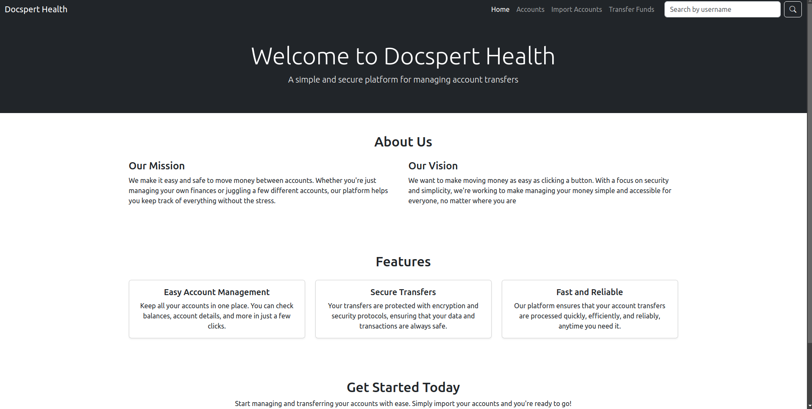
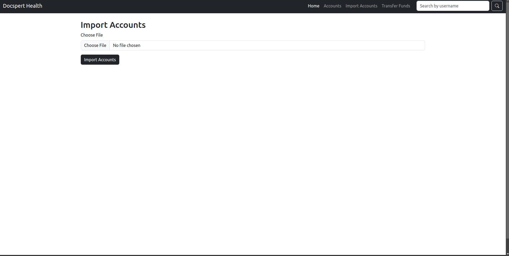
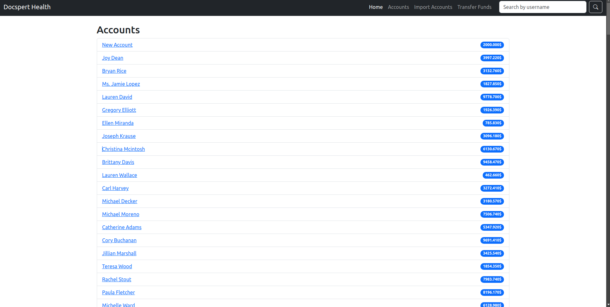
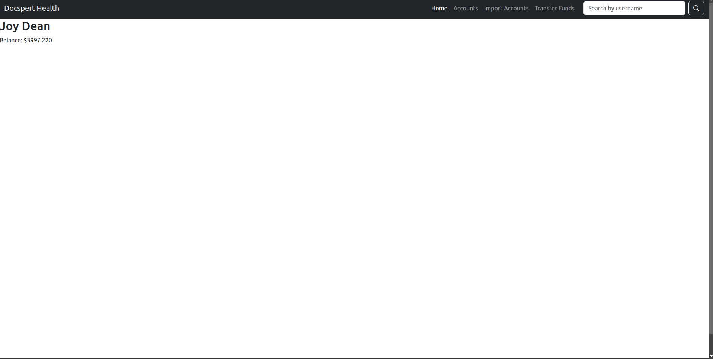
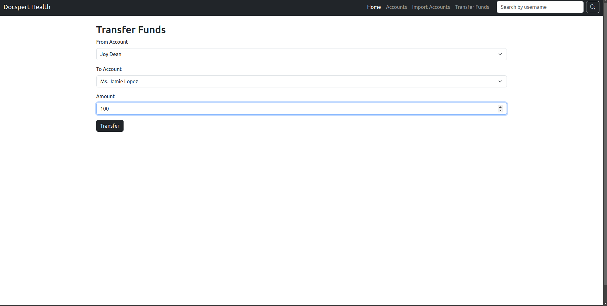

# Docspert-Health-Django-Task

This project is a Django-based application that simulates an account management system. It allows users to perform the following actions:

- Import accounts from a CSV file
- View a list of accounts
- View account details
- Transfer funds between accounts
- Search for accounts by name

## Screenshot of the Home Page



## Main Features

### 1. Import Accounts

Users can import accounts from a CSV file. The file must contain the following columns: `ID`, `name`, and `balance`.

#### Screenshot of Import Page



### 2. Account List

Displays a list of all accounts. Users can search for accounts by name using a search bar at the top.

#### Screenshot of Account List Page



### 3. Account Details

Displays the details of a specific account, including the name and balance.

#### Screenshot of Account Details Page



### 4. Transfer Funds

Users can transfer funds between accounts. The system ensures that the user has sufficient funds for the transaction.

#### Screenshot of Transfer Funds Page



## API Endpoints

The project includes several API endpoints to interact with the system programmatically.

### 1. Account List View

- **Endpoint**: `/api/accounts/`
- **Method**: `GET`
- **Description**: Returns a list of all accounts, with optional search filtering by account name.

### 2. Account Detail View

- **Endpoint**: `/api/accounts/{account_id}/`
- **Method**: `GET`
- **Description**: Returns the details of a specific account.

### 3. Transfer Funds View

- **Endpoint**: `/api/accounts/transfer/`
- **Method**: `POST`
- **Description**: Transfers funds between two accounts. Requires `from_account`, `to_account`, and `amount` parameters.

### 4. Import Accounts View

- **Endpoint**: `/api/accounts/import/`
- **Method**: `POST`
- **Description**: Imports accounts from a CSV file. The file must be included in the request.

## Docker Setup

### 1. Building the Docker Image

To build the Docker image, use the following command:

```bash
docker build -t docspert-health-django .
```

### 2. Running the Docker Container

Once the image is built, you can run the container with:

```bash
docker run -d -p 8000:8000 docspert-health-django
```

This will start the Django app on port 8000.

### 4. Accessing the Application

Once the Docker container is running, you can access the Django application by navigating to `http://localhost:8000/` in your browser.

## Installation

To set up the project locally, follow these steps:

1. Clone the repository:

```bash
git clone https://github.com/yourusername/docspert-health-django-task.git
cd docspert-health-django-task
```

2. Install the dependencies:

```bash
pip install -r requirements.txt
```

3. Run the server:

```bash
python manage.py runserver
```

You can now access the Django app locally at `http://127.0.0.1:8000/`.
